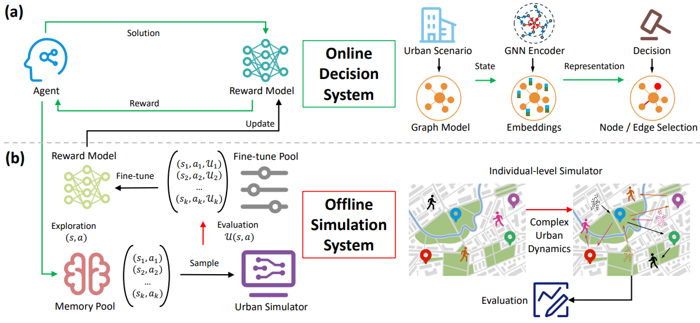
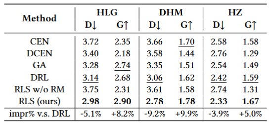
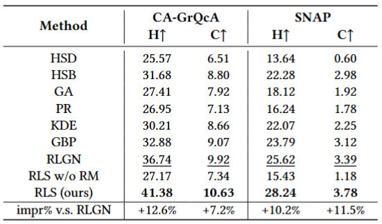
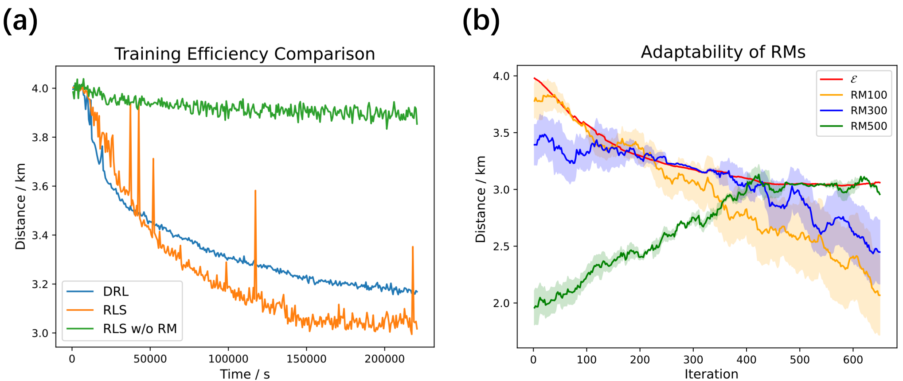
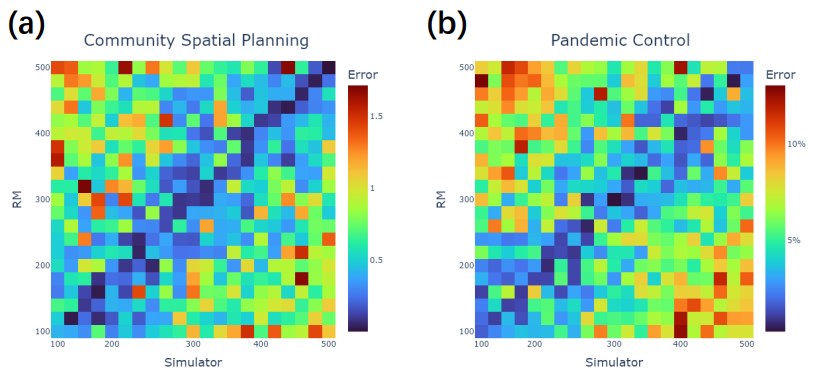
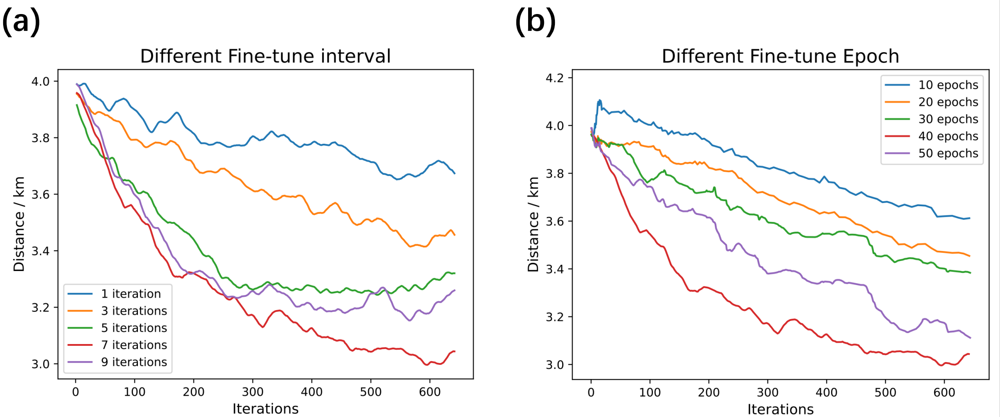

# Planning with Simulation

### Framework



We propose an efficient urban decision-making framework which incorporates a reward model to bridge the gap between the fast RL agent and the slow urban simulation.
By approximating simulated results with neural networks, our framework allows the RL agent to interact with the reward model in real time without delays while the slow simulation operates offline, addressing the simulation time bottleneck.
We further introduce adaptive reward modeling that continuously fine-tunes the reward model with the latest simulation data to align with the agent's policy, ensuring accurate reward approximation and avoiding outdated decision evaluation. 


# Installation 

### Environment
- Tested OS: Linux
- Python >= 3.8
- PyTorch == 1.10.1
- Tensorboard
### Dependencies:
1. Install [PyTorch 1.10.1](https://pytorch.org/get-started/previous-versions/) with the correct CUDA version.
2. Set the following environment variable to avoid problems with multiprocess trajectory sampling:
    ```
    export OMP_NUM_THREADS=1
    ```

# Training

You can train your own models using the provided config in `code/scenario/planning/cfg`:

```
python -m scenario.planning.train --cfg demo
```
You can replace `demo` to train other cfgs.

The results are saved in `result/cfg/seed`


# Result

## Overall Performance

We conduct experiments on both community spatial planning and pandemic control scenarios where our model outperforms all the advanced baselines with an average improvement of 12.6\% respectively.
- community spatial planning


- pandemic control



## Reward Model 


Benefiting from accurate evaluations from the urban simulator and fast RM estimations, RLS efficiently optimizes the decision policy and achieves the fastest convergence to generate optimal community layouts once the RM adapts to the current decision policy.
Moreover, all RMs accurately estimate community layouts generated around their respective iterations, with an average relative loss of less than 0.8\% and a relative standard deviation of less than 2.1\%.



As shown in the heatmap, the elements on the diagonal are approximately 0, indicating that the RM can always adapt to the current solutions with accurate estimations.


## Asynchronous Training Framework


With a short fine-tuning period, the samples in the fine-tuning pool $\mathcal{F}$ closely track the exploration subspace $\mathcal{E}$ but may lack sufficient samples due to time-consuming simulations.
On the other hand, a longer fine-tuning interval makes $\mathcal{F}$ denser and more efficient for RM fine-tuning, yet risks lagging RM updates significantly behind policy optimization, leading to misalignment between $\mathcal{O}$ and $\mathcal{E}$ and sub-optimal agent learning based on inaccurate RM feedback.
Meanwhile, insufficient time may diminish fine-tuning quality, while excessive time may force agents to iterate multiple times with outdated RM, wasting exploration efforts.


# License
Please see the [license](LICENSE) for further details.

## Note

The implemention is based on *[Transform2Act](https://github.com/Khrylx/Transform2Act)*.